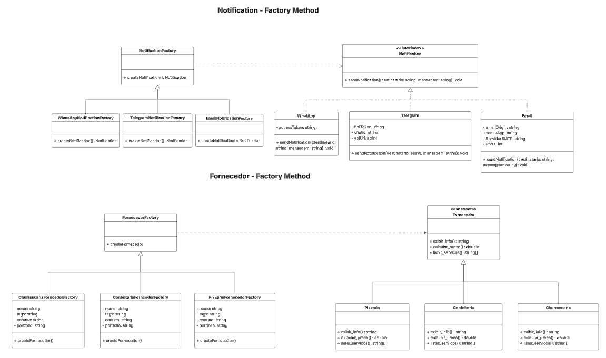
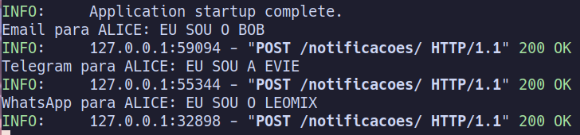

# Factory Method

## Participações

| Nome                                 |
|--------------------------------------|
| [Breno Queiroz Lima](https://github.com/brenob6)|
| [Leandro de Almeida Oliveira](https://github.com/leomitx10)   |
| [Letícia Resende da Silva](https://github.com/LeticiaResende23) |
| [Matheus Barros do Nascimento](https://github.com/Ninja-Haiyai) |
| [Vinicius Castelo](https://github.com/Vini47) |

## Introdução

<p align="justify"> &emsp;&emsp; Dentro dos padrões de projeto GoF (Gang of Four), descritos por Erich Gamma, Richard Helm, Ralph Johnson e John Vlissides no livro “Design Patterns: Elements of Reusable Object-Oriented Software”, publicado em 1994, existe a categoria dos padrões criacionais, que visam criar objetos de forma eficiente, levando em conta o contexto em que a criação ocorre.</p>

<p align="justify"> &emsp;&emsp;O padrão de projeto criacional Factory Method permite delegar a responsabilidade da criação de objetos para suas subclasses, encapsulando a escolha da classe concreta a ser instanciada. Isso facilita a extensão do sistema para suportar novos tipos de objetos, sem alterar o código existente, promovendo maior flexibilidade, reutilização e manutenção facilitada.</p>

## Objetivo

<p align="justify"> &emsp;&emsp; <p align="justify"> &emsp;&emsp;O padrão Factory Method tem como objetivo facilitar a criação de objetos mais complexos, como diferentes tipos de fornecedores e notificações, de uma forma mais flexível. Em vez de criar os objetos diretamente, o sistema passa essa tarefa para classes filhas ou especializadas, que sabem exatamente qual objeto criar. Isso ajuda a deixar o código mais organizado e separado, porque quem usa o objeto não precisa se preocupar com como ele é criado. Além disso, fica mais fácil adicionar novos tipos de objetos no futuro, sem precisar mexer em outras partes do sistema.</p>

## Metodologia

<p align="justify">&emsp;&emsp;Para desenvolver este trabalho, começamos com uma pesquisa teórica sobre o padrão de projeto Factory Method. Utilizamos como base o site Refactoring Guru e também os materiais passados pela professora, como slides e videoaulas. Essa etapa foi importante para que todos do grupo entendessem bem como o padrão funciona, seus objetivos e quando ele deve ser aplicado.</p> 
<p align="justify">&emsp;&emsp;Depois da pesquisa, o grupo se reuniu para discutir o que cada um aprendeu. Com isso, conseguimos trocar ideias e esclarecer dúvidas. Em conjunto, elaboramos um diagrama que representa o funcionamento do padrão Factory Method no contexto do nosso projeto. Esse diagrama serviu como guia para a próxima etapa.</p> 
<p align="justify">&emsp;&emsp;Com o diagrama pronto, partimos para a implementação no código do nosso projeto. Aplicamos o padrão Factory Method para resolver situações específicas, como a criação de diferentes tipos de fornecedores e notificações.</p>

## Diagrama

<b>Imagem 1: Factory Method</b>



Autor(a): 
<a href="https://github.com/brenob6" target="_blank">Breno Queiroz Lima</a>, 
<a href="https://github.com/leomitx10" target="_blank">Leandro de Almeida Oliveira</a>, 
<a href="https://github.com/LeticiaResende23" target="_blank">Letícia Resende da Silva</a>, 
<a href="https://github.com/Ninja-Haiyai" target="_blank">Matheus Barros do Nascimento</a> e 
<a href="https://github.com/Vini47" target="_blank">Vinicius Castelo</a>

## Análise do Diagrama

<p align="justify">&emsp;&emsp;Os diagramas “Notification – Factory Method” e “Fornecedor – Factory Method” mostram como o padrão Factory Method foi aplicado para separar a criação de objetos da lógica de uso, aumentando a flexibilidade e a manutenibilidade do sistema. Em cada caso, há uma fábrica abstrata (NotificationFactory ou FornecedorFactory) que declara um método genérico de criação (createNotification() ou createFornecedor()), sem saber concretamente qual classe será instanciada. As subclasses concretas dessas fábricas (WhatsAppNotificationFactory, TelegramNotificationFactory, EmailNotificationFactory, e, no outro diagrama, PizzariaFornecedorFactory, ConfeitariaFornecedorFactory, ChurrascariaFornecedorFactory) implementam esse método, retornando instâncias que seguem a interface abstrata correspondente (Notification ou Fornecedor).</p>

<p align="justify">&emsp;&emsp;No diagrama de notificações, a interface Notification define sendNotification(destinatario, mensagem), e cada classe concreta (WhatsApp, Telegram, Email) usa seus próprios atributos (tokens, credenciais, servidor SMTP etc.) para enviar a mensagem corretamente. No diagrama de fornecedores, a classe abstrata Fornecedor impõe métodos como exibir_info(), calcular_preco() e listar_servicos(), enquanto cada implementação (Pizzaria, Confeitaria, Churrascaria) contém a lógica particular de apresentação de dados e cálculo de preços.</p>

<p align="justify">&emsp;&emsp;Essa modelagem foi escolhida para que o código cliente nunca precise decidir “manualmen­te” qual classe instanciar ou misturar condicionais espalhadas (“se for WhatsApp, faça isto; se for Telegram, faça aquilo”). Basta injetar a fábrica desejada, chamar o método de criação e, em seguida, usar a interface abstrata. Assim, adicionar novos canais de notificação ou novos tipos de fornecedor no futuro exige apenas a criação de uma nova fábrica concreta e de uma classe concreta que implemente a interface correspondente, sem modificar o restante da aplicação. Esse padrão, portanto, garante maior desacoplamento, facilita testes unitários (por meio de fábricas simuladas) e mantém o código organizado e preparado para evoluções.</p>


## Código do UML Diagrama de Classes

`Class Notification`

```py
class Notification(ABC):
    @abstractmethod
    def send_notification(self, destinatario: str, mensagem: str) -> None:
        pass

```

<br>

`Class WhatsApp(Notification)`

```py
class WhatsApp(Notification):
    def __init__(self):
        self.access_token = "access-token-whatsapp"
    
    def send_notification(self, destinatario: str, mensagem: str) -> None:
        # Lógica para enviar notificação via WhatsApp
        print(f"WhatsApp para {destinatario}: {mensagem}")

```

<br>

`Class Telegram(Notification)`

```py
class Telegram(Notification):
    def __init__(self):
        self.bot_token = "bot-token-telegram"
        self.chat_id = "default-chat-id"
        self.api_url = "https://api.telegram.org"
    
    def send_notification(self, destinatario: str, mensagem: str) -> None:
        # Lógica para enviar notificação via Telegram
        print(f"Telegram para {destinatario}: {mensagem}")
```

<br>

`Class Email(Notification)`

```py
class Email(Notification):
    def __init__(self):
        self.email_origin = "sistema@festas.com"
        self.senha_app = "senha-app-email"
        self.servidor_smtp = "smtp.festas.com"
        self.porta = 587
    
    def send_notification(self, destinatario: str, mensagem: str) -> None:
        # Lógica para enviar notificação via Email
        print(f"Email para {destinatario}: {mensagem}")
```

<br>

`Class Notification Factory`

```py
class NotificationFactory(ABC):
    @abstractmethod
    def create_notification(self) -> Notification:
        pass
```

<br>

`Class WhatsApp Notification Factory (Notification Factory)`

```py
class WhatsAppNotificationFactory(NotificationFactory):
    def create_notification(self) -> Notification:
        return WhatsApp()
```

<br>

`Class Telegram Notification Factory (Notification Factory)`

```py
class TelegramNotificationFactory(NotificationFactory):
    def create_notification(self) -> Notification:
        return Telegram()

```

<br>

`Class Email Notification Factory (Notification Factory)`

```py
class EmailNotificationFactory(NotificationFactory):
    def create_notification(self) -> Notification:
        return Email()
```

<br>

`Class Notification Service`

```py
class NotificationService:
    def __init__(self, notification_factory: NotificationFactory):
        self.notification = notification_factory.create_notification()
    
    def notify(self, destinatario: str, mensagem: str) -> None:
        self.notification.send_notification(destinatario, mensagem)
```

## Saída

Para exemplificar a saída do código foi feito um endpoint para envio das notifições.
Nesse endpoint é possível determinar o tipo de classe que será criado pelo factory.

Vale resaltar que o endpoint serve apenas para fins demonstrativos. O aplicativo final
não utilizara do endpoint para enviar as notificações, mas sim de eventos programaticos.




## Conclusão

<p align="justify">&emsp;&emsp;A adoção do padrão Factory Method em nosso site mostrou‐se fundamental para conferir maior organização, flexibilidade e manutenibilidade ao código. Através da abstração na criação de objetos — tanto de notificações (WhatsApp, Telegram, Email) quanto de fornecedores (Pizzaria, Confeitaria, Churrascaria) — conseguimos delegar a responsabilidade de instanciá‐los às classes‐fábrica especializadas. Dessa forma, mantivemos o sistema aberto a novas extensões sem a necessidade de alterar a lógica central: sempre que for necessária uma nova forma de notificação ou um novo tipo de fornecedor, basta implementar uma fábrica concreta correspondente, seguindo o contrato definido pela interface abstrata.</p>

<p align="justify">&emsp;&emsp;Do ponto de vista prático, esse desacoplamento tornou o código mais coeso e fácil de entender. Cada fábrica encapsula detalhes específicos de configuração—por exemplo, tokens de API, credenciais de SMTP ou informações de contato—manterndo essas variáveis isoladas do restante da aplicação. Isso não apenas melhora a legibilidade, mas também facilita a criação de testes automatizados, pois podemos injetar fábricas simuladas e verificar comportamentos sem depender de serviços externos.</p>

<p align="justify">&emsp;&emsp;Além disso, a colaboração em equipe se beneficiou do diagrama elaborado: ao clarear as responsabilidades de cada classe abstrata e concreta, todos puderam compreender rapidamente como o fluxo de criação se dá em cada contexto (notificações ou fornecedores). O processo de pesquisa teórica, a discussão em grupo e a implementação prática reforçaram o domínio coletivo sobre o padrão, garantindo que cada membro contribuísse de forma alinhada aos princípios propostos pelo Factory Method.</p>

<p align="justify">&emsp;&emsp;Em suma, a aplicação desse padrão em nosso projeto culminou em um sistema estruturado, modular e preparado para evolução contínua. Com o Factory Method, asseguramos que novas demandas—sejam elas a integração com um novo canal de mensagens ou a inclusão de diferentes categorias de fornecedores—possam ser atendidas de maneira simples, sem comprometer o restante da base de código. Dessa maneira, concluímos que o padrão Factory Method não apenas atende às necessidades atuais do site, mas também estabelece um caminho estável para futuras expansões e manutenções.</p>


## Bibliografica

[1] **SERRANO, M.**. *Material em Slides*. Disponível em: <https://aprender3.unb.br/pluginfile.php/3075185/mod_page/content/1/Arquitetura%20e%20Desenho%20de%20Software%20-%20Aula%20GoFs%20Criacionais%20-%20Profa.%20Milene.pdf.>  Acesso em: 28 Mai. 2025.

[2] **SERRANO, M.** *Video-Aula - DSW - GoFs - Criacionais - MetodoFabrica*. Disponível em: <https://unbbr-my.sharepoint.com/personal/mileneserrano_unb_br/_layouts/15/stream.aspx?id=%2Fpersonal%2Fmileneserrano%5Funb%5Fbr%2FDocuments%2FArqDSW%20%2D%20V%C3%ADdeosOriginais%2F08b%20%2D%20Video%2DAula%20%2D%20DSW%20%2D%20GoFs%20%2D%20Criacionais%20%2D%20MetodoFabrica%2Emp4&ga=1&referrer=StreamWebApp%2EWeb&referrerScenario=AddressBarCopied%2Eview%2Ed3ad217f%2D9a09%2D4ecd%2D92dc%2Df6275aa62000>. Acesso em: 28 Mai. 2025.


## Histórico de versões

| Versão |    Data    |                       Descrição                       |                       Autor(es)                        |                      Revisor(es)                       |
| :----: | :--------: | :---------------------------------------------------: | :----------------------------------------------------: | :----------------------------------------------------: |
| `1.0`  | 29/05/2025 | Adicionando diagrama e metodologia, ajudei na criação da notification e fornecedor do UML e nos demais códigos | [Leandro de Almeida Oliveira](https://github.com/leomitx10) |  [Letícia Resende da Silva](https://github.com/LeticiaResende23)  |
| `1.1`  | 01/05/2025 | Adicionando análise do diagrama, ajudei na criação da notification e fornecedor do UML e nos demais códigos | [Matheus Barros do Nascimento](https://github.com/Ninja-Haiyai) |  [Letícia Resende da Silva](https://github.com/LeticiaResende23)  |
| `1.2`  | 01/05/2025 | Adicionando introdução, objetivo, bibliografia e conclusão, código, ajudei na criação da notification e fornecedor do UML e nos demais códigos | [Letícia Resende da Silva](https://github.com/LeticiaResende23) | [Leandro de Almeida Oliveira](https://github.com/leomitx10)   |
| `1.3`  | 01/05/2025 | Ajudei na criação da notification e fornecedor do UML e nos demais códigos | [Vinicius Castelo](https://github.com/Vini47) | [Leandro de Almeida Oliveira](https://github.com/leomitx10)   |
| `1.4`  | 01/05/2025 | Ajudei na criação da notification e fornecedor do UML e nos demais códigos | [Breno Queiroz Lima](https://github.com/brenob6) | [Letícia Resende da Silva](https://github.com/LeticiaResende23) |
| `1.5`  | 01/05/2025 | Texto do tópico saída | [Breno Queiroz Lima](https://github.com/brenob6) | [Letícia Resende da Silva](https://github.com/LeticiaResende23) |
