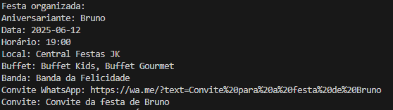

# Builder

## Participações

| Nome                                 |
|--------------------------------------|
| [Breno Soares Fernandes](https://github.com/brenofrds)|
| [Bruno de Oliveira](https://github.com/BrunoOLiveirax) |
| [Bruno Ricardo de Menezes](https://github.com/EhOBruno) |
| [Hauedy Wegener Soares](https://github.com/HauedyWS) |
| [Mayara Alves de Oliveira](https://github.com/Mayara-tech) |

## Introdução

<p align="justify">&emsp;&emsp;O padrão de projeto Builder, pertencente à categoria dos padrões criacionais descritos pelo GoF (Gang of Four), tem como principal objetivo separar a construção de um objeto complexo da sua representação final. Esse padrão é útil quando um objeto pode ser construído de várias maneiras ou exige múltiplos passos para sua montagem.</p> <p align="justify">&emsp;&emsp;Neste projeto, o padrão Builder foi aplicado para estruturar a montagem de uma <b>festa organizada</b>, com base nas preferências de um aniversariante e nas escolhas feitas pelo organizador por meio da interface do sistema. A construção da festa é realizada em etapas independentes, como a seleção do local, do buffet e da banda, até a geração de um convite final com as informações consolidadas.</p> 

## Objetivo

<p align="justify">&emsp;&emsp;O padrão Builder tem como objetivo facilitar a criação de objetos complexos, como a estrutura completa de uma festa organizada, de forma flexível e controlada. Em vez de montar todos os detalhes da festa diretamente, o sistema delega essa tarefa a uma classe especializada (o builder), que sabe como construir cada parte da festa com base nas informações fornecidas.</p> <p align="justify">&emsp;&emsp;Isso permite que o organizador defina separadamente o local, o buffet, a banda e outros detalhes, sem se preocupar com a lógica de montagem do objeto final. Ao final do processo, um convite é gerado com todas as informações reunidas. Além de tornar o código mais modular e reutilizável, o uso do Builder facilita a manutenção e a expansão futura do sistema</p>

## Metodologia

<p align="justify">&emsp;&emsp;Para o desenvolvimento deste trabalho, utilizamos como base os slides fornecidos pela professora durante as aulas, que explicam o funcionamento do padrão de projeto Builder. Esse material foi essencial para que todos os integrantes do grupo compreendessem os conceitos teóricos, o objetivo do padrão e sua aplicação em sistemas que exigem a criação de objetos complexos em etapas.</p>

<p align="justify">&emsp;&emsp;Após o estudo dos slides, o grupo se reuniu para discutir como o padrão Builder poderia ser aplicado no contexto do nosso sistema de organização de festas. A partir dessas discussões, elaboramos um diagrama UML representando os principais elementos do padrão, adaptando-o à realidade do projeto.</p>

<p align="justify">&emsp;&emsp;Com o diagrama pronto, partimos para a implementação no código. O padrão Builder foi utilizado para estruturar a criação de uma festa completa, permitindo ao organizador definir o local, o buffet, a banda e, ao final, gerar automaticamente um convite com todas as informações consolidadas.</p>


## Diagrama Builder

<center>

<b>Imagem 1: Builder (Organização Completa da Festa)<br>


Autor(a):
<a href="https://github.com/brenofrds" target="_blank">Breno Soares Fernandes</a>,
<a href="https://github.com/BrunoOLiveirax" target="_blank">Bruno de Oliveira</a>,
<a href="https://github.com/EhOBruno" target="_blank">Bruno Ricardo de Menezes</a>,
<a href="https://github.com/HauedyWS" target="_blank">Hauedy Wegener Soares</a> e
<a href="https://github.com/Mayara-tech" target="_blank">Mayara Alves de Oliveira</a>

</center>

## Análise do Diagrama

<p align="justify">&emsp;&emsp;O diagrama representa a aplicação do padrão Builder no contexto da organização de uma festa personalizada. A classe principal `OrganizadorDeFesta`, que atua como o <b>Director</b>, é responsável por orquestrar o processo de montagem da festa utilizando os métodos definidos na interface `FestaBuilder`.

<p align="justify">&emsp;&emsp;A implementação concreta `FestaPersonalizadaBuilder` executa cada etapa do processo com base nos dados presentes na classe `PlanoDeFesta`. Esses dados incluem informações como local escolhido, buffet, banda, nome do aniversariante, data e horário. A cada chamada do builder, uma parte da `FestaOrganizada` (produto final) é construída. Embora seja comum encontrar múltiplas implementações concretas do padrão Builder, neste projeto optamos por adaptar o modelo para a nossa realidade e utilizar apenas uma implementação para atender as nossas necessidades.
 
<p align="justify">&emsp;&emsp;O uso do padrão Builder neste cenário permite dividir o processo de construção em etapas claras e independentes, como selecionar fornecedores e gerar o convite final. Isso torna o sistema mais modular, reutilizável e preparado para futuras extensões, como a adição de novos fornecedores ou serviços adicionais. O encapsulamento da lógica de montagem também reduz o acoplamento entre as classes e facilita a manutenção do sistema.


## Código UML Builder

```python
from abc import ABC, abstractmethodAdd commentMore actions
from typing import List, Optional
from datetime import date

class PlanoDeFesta:
    def __init__(
        self,
        buffetEscolhidas: List[str],
        bandaEscolhida: str,
        nomeAniversariante: str,
        data: date,
        horario: str,
        localFornecedor: str
    ):
        self.buffetEscolhidas = buffetEscolhidas
        self.bandaEscolhida = bandaEscolhida
        self.nomeAniversariante = nomeAniversariante
        self.data = data
        self.horario = horario
        self.localFornecedor = localFornecedor

class FestaOrganizada:
    def __init__(
        self,
        nomeAniversariante: str,
        data: date,
        horario: str,
        localFornecedor: str,
        buffet: List[str],
        banda: str,
        linkWhatsapp: Optional[str] = None,
        convite: Optional[str] = None
    ):
        self.nomeAniversariante = nomeAniversariante
        self.data = data
        self.horario = horario
        self.localFornecedor = localFornecedor
        self.buffet = buffet
        self.banda = banda
        self.linkWhatsapp = linkWhatsapp
        self.convite = convite

class FestaBuilder(ABC):
    @abstractmethod
    def escolherLocalFornecedor(self): pass

    @abstractmethod
    def selecionarBuffet(self): pass

    @abstractmethod
    def contratarBanda(self): pass

    @abstractmethod
    def gerarConvite(self): pass

    @abstractmethod
    def getFesta(self) -> FestaOrganizada: pass

class FestaPersonalizadaBuilder(FestaBuilder):
    def __init__(self, plano: PlanoDeFesta):
        self.plano = plano
        self.festa = FestaOrganizada(
            nomeAniversariante=plano.nomeAniversariante,
            data=plano.data,
            horario=plano.horario,
            localFornecedor="",
            buffet=[],
            banda=""
        )

    def escolherLocalFornecedor(self):
        self.festa.localFornecedor = self.plano.localFornecedor

    def selecionarBuffet(self):
        self.festa.buffet = self.plano.buffetEscolhidas

    def contratarBanda(self):
        self.festa.banda = self.plano.bandaEscolhida

    def gerarConvite(self):
        self.festa.linkWhatsapp = f"https://wa.me/?text=Convite%20para%20a%20festa%20de%20{self.plano.nomeAniversariante}"
        self.festa.convite = f"Convite da festa de {self.plano.nomeAniversariante}"

    def getFesta(self) -> FestaOrganizada:
        return self.festa

class OrganizadorDeFesta:
    def construirFesta(self, builder: FestaBuilder) -> FestaOrganizada:
        builder.escolherLocalFornecedor()
        builder.selecionarBuffet()
        builder.contratarBanda()
        builder.gerarConvite()Add commentMore actions
        return builder.getFesta()
```
## Saída



## Conclusão

<p align="justify">&emsp;&emsp;A aplicação do padrão de projeto Builder para a organização de festas permitiu ao grupo compreender de forma prática a importância da separação entre a construção de um objeto complexo e sua representação final. Com o uso do Builder, foi possível modularizar o processo de montagem da festa, tornando cada etapa independente, o que facilita a manutenção e possibilita futuras expansões do sistema sem impactar a lógica central.

<p align="justify">&emsp;&emsp;A implementação também reforçou a utilidade desse padrão em cenários reais, como o de eventos personalizados, onde diversos fornecedores e serviços podem variar de acordo com as preferências do cliente. Essa flexibilidade, associada à clareza no código e à facilidade de testes e alterações, demonstra a relevância do padrão Builder no desenvolvimento de sistemas mais robustos, escaláveis e de fácil manutenção.

<p align="justify">&emsp;&emsp;Por fim, o trabalho em equipe foi essencial para alinhar o entendimento teórico e transformá-lo em uma implementação prática e funcional, evidenciando que o uso de padrões de projeto é uma prática valiosa para o desenvolvimento de software de qualidade.


## Bibliografia

[1] **SERRANO, M..** Material Complementar - Aula GoFs Criacionais. Disponível em: Disponível em: Aprender3 da turma. Acesso em: 01 Jun. 2025.

[2] **SERRANO, M..** 08d - Video-Aula - DSW - GoFs - Criacionais - Demais. Disponível em: Aprender3 da turma. Acesso em: 01 Jun. 2025.


## Histórico de versões

| Versão |    Data    |                       Descrição                       |                       Autor(es)                        |
| :----: | :--------: | :---------------------------------------------------: | :----------------------------------------------------: |
| `1.0`  | 28/05/2025 | Estruturação do padrão Builder em reunião, com participação de todos os integrantes do grupo. | [Breno Soares Fernandes](https://github.com/brenofrds), [Bruno de Oliveira](https://github.com/BrunoOLiveirax), [Bruno Ricardo de Menezes](https://github.com/EhOBruno), [Hauedy Wegener Soares](https://github.com/HauedyWS) , [Mayara Alves de Oliveira](https://github.com/Mayara-tech)  |
| `1.1`  | 01/06/2025 | Redação da documentação e organização da página do padrão Builder. | [Breno Soares Fernandes](https://github.com/brenofrds), [Bruno de Oliveira](https://github.com/BrunoOLiveirax) |

