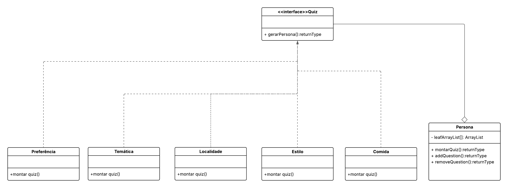
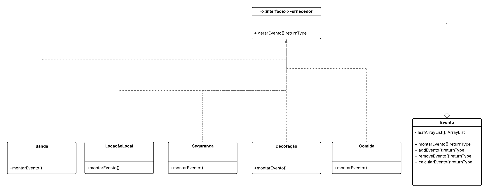
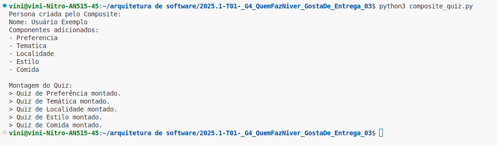
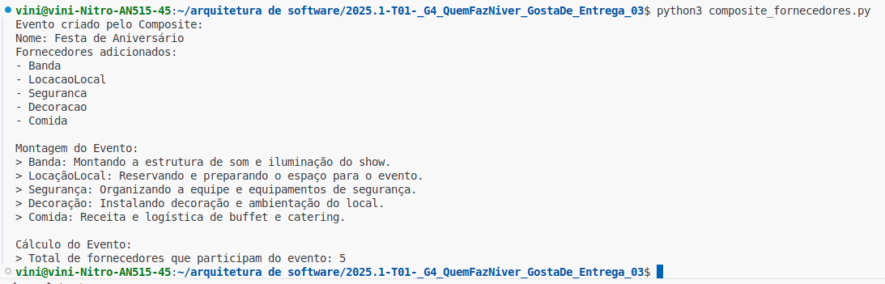

# Composite

## Participações

| Nome                                 |
|--------------------------------------|
| [Breno Soares Fernandes](https://github.com/brenofrds)|
| [Bruno de Oliveira](https://github.com/BrunoOLiveirax) |
| [Bruno Ricardo de Menezes](https://github.com/EhOBruno) |
| [Matheus Barros do Nascimento](https://github.com/Ninja-Haiyai) |
| [Vinicius Castelo](https://github.com/Vini47) |

## Introdução
<p align="justify">&emsp;&emsp;Dentro dos padrões de projeto GoF (Gang of Four), descritos por Erich Gamma, Richard Helm, Ralph Johnson e John Vlissides no livro “Design Patterns: Elements of Reusable Object-Oriented Software”, publicado em 1994, existe a categoria dos padrões estruturais, que têm como objetivo facilitar a composição de classes e objetos para formar estruturas maiores e mais flexíveis.</p>

<p align="justify">&emsp;&emsp;O padrão de projeto estrutural Composite permite compor objetos em estruturas de árvore para representar hierarquias parte-todo. Esse padrão trata objetos individuais e composições de objetos de maneira uniforme, facilitando a manipulação de grupos complexos como se fossem objetos simples, promovendo maior flexibilidade e reutilização no código.</p>


## Objetivo
<p align="justify">&emsp;&emsp;O padrão Composite é usado quando queremos representar estruturas em forma de árvore, como pastas e arquivos em um sistema. Ele permite que objetos individuais e grupos de objetos sejam tratados da mesma forma. Isso é útil quando temos elementos que podem conter outros elementos e queremos percorrê-los ou manipulá-los sem precisar ficar verificando o tipo de cada um.</p>

<p align="justify">&emsp;&emsp;Com esse padrão, podemos montar estruturas mais flexíveis e reutilizáveis, já que a lógica para lidar com um item simples ou com um conjunto de itens pode ser feita da mesma maneira. Isso ajuda a manter o código mais limpo e fácil de estender, principalmente quando estamos lidando com hierarquias complexas.</p>


## Metodologia
<p align="justify"> &emsp;&emsp;Para desenvolver esta parte do trabalho, iniciamos com uma pesquisa teórica sobre o padrão de projeto Composite. Utilizamos como base o site Refactoring Guru, além dos materiais disponibilizados pela professora, como slides e videoaulas. Essa etapa foi essencial para que todos do grupo entendessem a estrutura do padrão, seus princípios e os contextos ideais para sua aplicação.</p> 
<p align="justify"> &emsp;&emsp;Após a pesquisa, o grupo se reuniu para compartilhar o conhecimento adquirido. Durante essa troca, discutimos as vantagens do padrão Composite para tratar objetos que possuem uma hierarquia, possibilitando que componentes simples e compostos sejam manipulados de forma uniforme. Isso fortaleceu a compreensão coletiva sobre como aplicar o padrão em nosso projeto.</p> 
<p align="justify"> &emsp;&emsp;Com essa base, elaboramos um diagrama que representa a utilização do padrão Composite no nosso sistema, focando na organização e gerenciamento hierárquico dos elementos de convites. Em seguida, implementamos o padrão no código, permitindo que objetos simples e grupos de objetos fossem tratados de maneira consistente. Isso contribuiu para um código mais organizado, escalável e com maior facilidade para manipular estruturas complexas dentro do projeto.</p>


## Análise do Diagrama Composite

<center>

<b>Imagem 1: Composite Quiz</b>



Autor(a):  
<a href="https://github.com/Ninja-Haiyai" target="_blank">Matheus Barros do Nascimento</a>, 
<a href="https://github.com/Vini47" target="_blank">Vinicius Castelo</a>,
<a href="https://github.com/brenofrds" target="_blank">Breno Soares Fernandes</a>,
<a href="https://github.com/BrunoOLiveirax" target="_blank">Bruno de Oliveira</a> e 
<a href="https://github.com/EhOBruno" target="_blank">Bruno Ricardo de Menezes</a>

<p align="justify">&emsp;&emsp;O diagrama UML apresentado ilustra um possível cenário de aplicação do padrão Composite de GoF, embora com uma interpretação que se afasta da sua aplicação mais clássica. O padrão Composite é tipicamente utilizado para compor objetos em estruturas de árvore para representar hierarquias parte-todo, permitindo que clientes tratem objetos individuais e composições de objetos de forma uniforme. No diagrama, a interface <<Interface>> Quiz e a classe Persona parecem estar envolvidas em um mecanismo de montagem de quizzes, onde Persona agrega um ArrayList que poderia, em um cenário de Composite, conter instâncias de diferentes tipos de "componentes" que contribuem para o quiz. As classes Preferência, Temática, Localidade, Estilo e Comida poderiam ser interpretadas como "folhas" (ou componentes individuais) que implementam alguma interface comum (talvez implícita ou omitida no diagrama, que poderia ser a mesma do Quiz ou uma nova interface para os componentes) e cada uma possui um método montar quiz(). Contudo, a relação direta dessas classes com a interface Quiz através de linhas pontilhadas (que geralmente indicam dependência ou realização de interface, embora sem a seta de realização clara) e a associação forte de Persona com Quiz (através da agregação) sugerem que Persona pode estar orquestrando a criação de um quiz baseado em diferentes aspectos definidos por essas classes. Para ser um Composite clássico, as classes Preferência, Temática, etc., deveriam ter uma relação de implementação direta com uma interface de "componente" que a classe Persona ou a própria Quiz (se ela for o "composite") pudesse tratar uniformemente, permitindo que um quiz fosse composto por um ou mais desses elementos, seja individualmente ou em agrupamentos. A estrutura atual parece mais uma agregação de características ou critérios para a montagem de um quiz, onde Persona atua como o "contexto" ou "cliente" que utiliza esses elementos para construir o quiz final.


<b>Imagem 2: Composite Fornecedor</b>



Autor(a):  
<a href="https://github.com/Ninja-Haiyai" target="_blank">Matheus Barros do Nascimento</a>, 
<a href="https://github.com/Vini47" target="_blank">Vinicius Castelo</a>,
<a href="https://github.com/brenofrds" target="_blank">Breno Soares Fernandes</a>,
<a href="https://github.com/BrunoOLiveirax" target="_blank">Bruno de Oliveira</a> e 
<a href="https://github.com/EhOBruno" target="_blank">Bruno Ricardo de Menezes</a>

</center>

<p align="justify">&emsp;&emsp;O diagrama UML fornecido apresenta uma estrutura que remete ao padrão Composite de GoF, embora com uma interpretação que o adapta para a montagem de um evento em vez da composição hierárquica tradicional, onde a interface <<interface>> Fornecedor e a classe Evento são os elementos centrais; a classe Evento possui uma agregação com si mesma (o leafArrayList genérico), sugerindo que pode conter uma coleção de componentes que contribuem para o evento, e as classes Banda, LocaçãoLocal, Segurança, Decoração e Comida atuam como "folhas" ou componentes individuais, cada uma com o método montarEvento(), indicando que realizam uma ação específica para a criação do evento, e suas relações pontilhadas com Fornecedor sugerem que elas implementam essa interface, tornando-as "fornecedores" de partes do evento; se a interface Fornecedor fosse uma interface de "componente" que Evento também implementasse, e as classes de serviço também implementassem essa mesma interface, Evento funcionaria como o "composite" que pode conter múltiplos "fornecedores", tratando-os uniformemente, reforçando a ideia de que Evento gerencia e orquestra a composição a partir de seus elementos constituintes, aproximando-se do padrão Composite ao permitir que um Evento seja construído a partir de diferentes "fornecedores" que atuam como suas partes.

## Código do UML Composite

 `Composite Quiz`

```python
from abc import ABC, abstractmethod

class Quiz(ABC):
    @abstractmethod
    def montar_quiz(self):
        pass

class Preferencia(Quiz):
    def montar_quiz(self):
        return "Quiz de Preferência montado."

class Tematica(Quiz):
    def montar_quiz(self):
        return "Quiz de Temática montado."

class Localidade(Quiz):
    def montar_quiz(self):
        return "Quiz de Localidade montado."

class Estilo(Quiz):
    def montar_quiz(self):
        return "Quiz de Estilo montado."

class Comida(Quiz):
    def montar_quiz(self):
        return "Quiz de Comida montado."

class Persona(Quiz):
    def __init__(self, nome):
        self.nome = nome
        self.leafArrayList = []

    def addQuestion(self, componente: Quiz):
        self.leafArrayList.append(componente)

    def removeQuestion(self, componente: Quiz):
        if componente in self.leafArrayList:
            self.leafArrayList.remove(componente)

    def montar_quiz(self):
        resultados = []
        for child in self.leafArrayList:
            resultados.append(child.montar_quiz())
        return resultados

if __name__ == "__main__":
    persona = Persona("Usuário Exemplo")
    
    pref    = Preferencia()
    tema    = Tematica()
    loc     = Localidade()
    estilo  = Estilo()
    comida  = Comida()
    
    persona.addQuestion(pref)
    persona.addQuestion(tema)
    persona.addQuestion(loc)
    persona.addQuestion(estilo)
    persona.addQuestion(comida)
    
    print("Persona criada pelo Composite:")
    print(f"Nome: {persona.nome}")
    print("Componentes adicionados:")
    for comp in persona.leafArrayList:
        print(f"- {comp.__class__.__name__}")
    
    print("\nMontagem do Quiz:")
    for resultado in persona.montar_quiz():
        print(f"> {resultado}")

```

`Composite Fornecedor`

```python
from abc import ABC, abstractmethod

class Fornecedor(ABC):
    @abstractmethod
    def montar_evento(self):
        pass

class Banda(Fornecedor):
    def montar_evento(self):
        return "Banda: Montando a estrutura de som e iluminação do show."

class LocacaoLocal(Fornecedor):
    def montar_evento(self):
        return "LocaçãoLocal: Reservando e preparando o espaço para o evento."

class Seguranca(Fornecedor):
    def montar_evento(self):
        return "Segurança: Organizando a equipe e equipamentos de segurança."

class Decoracao(Fornecedor):
    def montar_evento(self):
        return "Decoração: Instalando decoração e ambientação do local."

class Comida(Fornecedor):
    def montar_evento(self):
        return "Comida: Receita e logística de buffet e catering."

class Evento(Fornecedor):
    def __init__(self, nome: str):
        self.nome = nome
        self.leafArrayList = []

    def addEvento(self, componente: Fornecedor):
        self.leafArrayList.append(componente)

    def removeEvento(self, componente: Fornecedor):
        if componente in self.leafArrayList:
            self.leafArrayList.remove(componente)

    def montar_evento(self):
        resultados = []
        for child in self.leafArrayList:
            resultados.append(child.montar_evento())
        return resultados

    def calcular_evento(self):
        total = len(self.leafArrayList)
        return f"Total de fornecedores que participam do evento: {total}"

if __name__ == "__main__":
    evento = Evento("Festa de Aniversário")

    banda       = Banda()
    local       = LocacaoLocal()
    seguranca   = Seguranca()
    decoracao   = Decoracao()
    comida      = Comida()

    evento.addEvento(banda)
    evento.addEvento(local)
    evento.addEvento(seguranca)
    evento.addEvento(decoracao)
    evento.addEvento(comida)

    print("Evento criado pelo Composite:")
    print(f"Nome: {evento.nome}")
    print("Fornecedores adicionados:")
    for comp in evento.leafArrayList:
        print(f"- {comp.__class__.__name__}")

    print("\nMontagem do Evento:")
    for resultado in evento.montar_evento():
        print(f"> {resultado}")

    print("\nCálculo do Evento:")
    print(f"> {evento.calcular_evento()}")

```

## Saída

`Composite Quiz`



<br>

`Composite Fornecedor`




## Conclusão

<p align="justify">&emsp;&emsp;Por meio do desenvolvimento deste trabalho, foi possível compreender de forma prática e teórica como o padrão de projeto Composite contribui para a construção de sistemas mais organizados, escaláveis e flexíveis. A aplicação do padrão mostrou-se bastante útil em cenários onde existe uma hierarquia de objetos, permitindo tratar componentes simples e compostos de maneira uniforme.</p>

<p align="justify">&emsp;&emsp;Durante a elaboração dos diagramas e da implementação, ficou evidente que, embora seja necessário adaptar o padrão às particularidades do domínio do problema, sua essência — tratar objetos individuais e composições de forma homogênea — foi preservada. Isso proporcionou uma estrutura de código mais limpa, fácil de manter e de estender, além de fortalecer a capacidade de abstração e modelagem do grupo.</p>

<p align="justify">&emsp;&emsp;Portanto, o estudo e a aplicação do padrão Composite não só enriqueceram nosso entendimento sobre os padrões de projeto, mas também demonstraram, na prática, como boas práticas de arquitetura de software impactam diretamente na qualidade, na organização e na evolução dos sistemas desenvolvidos.</p>

## Bibliografica
[1] **SERRANO, M.**. *Material em Slides*. Disponível em: <https://aprender3.unb.br/pluginfile.php/3075186/mod_page/content/1/Arquitetura%20e%20Desenho%20de%20Software%20-%20Aula%20GoFs%20Estruturais%20-%20Profa.%20Milene.pdf>  Acesso em: 29 Mai. 2025.

[2] **SERRANO, M.** *09a - Vídeo-Aula - DSW - GoFs - Estruturais*. Disponível em: <https://unbbr-my.sharepoint.com/:v:/g/personal/mileneserrano_unb_br/EdRWnnpbK8BJqcsgzvh1HRUBFjYsL1ncotuK486gTMhePA?e=t1Qd66>. Acesso em: 29 Mai. 2025.

[3] **REFACTORING GURU**. *Composite Design Pattern*. Disponível em: <https://refactoring.guru/design-patterns/composite>. Acesso em: 29 Mai. 2025.


## Histórico de versões

| Versão |    Data    |                       Descrição                       |                        Autor                          |                      Revisor(es)                       |
| :----: | :--------: | :---------------------------------------------------: | :--------------------------------------------------: | :----------------------------------------------------: |
| `1.0`  | 01/06/2025 |          Adicionado Introdução, Objetivo, Metodologia  e Bibliografia       | [Matheus Barros do Nascimento](https://github.com/Ninja-Haiyai) |                  [Breno Soares Fernandes](https://github.com/brenofrds), [Bruno de Oliveira](https://github.com/BrunoOLiveirax), [Bruno Ricardo de Menezes](https://github.com/EhOBruno) e [Vinicius Castelo](https://github.com/Vini47)                                    |
| `1.1`  | 01/06/2025 |          Adicionado Análise do Diagrama e Conclusão       | [Vinicius Castelo](https://github.com/Vini47) |         [Breno Soares Fernandes](https://github.com/brenofrds), [Bruno de Oliveira](https://github.com/BrunoOLiveirax), [Bruno Ricardo de Menezes](https://github.com/EhOBruno),  [Matheus Barros do Nascimento](https://github.com/Ninja-Haiyai)                                            |
| `1.2`  | 01/06/2025 |          Adicionado codigos e saida       | [Vinicius Castelo](https://github.com/Vini47) |         [Breno Soares Fernandes](https://github.com/brenofrds), [Bruno de Oliveira](https://github.com/BrunoOLiveirax), [Bruno Ricardo de Menezes](https://github.com/EhOBruno),  [Matheus Barros do Nascimento](https://github.com/Ninja-Haiyai)                                            |
