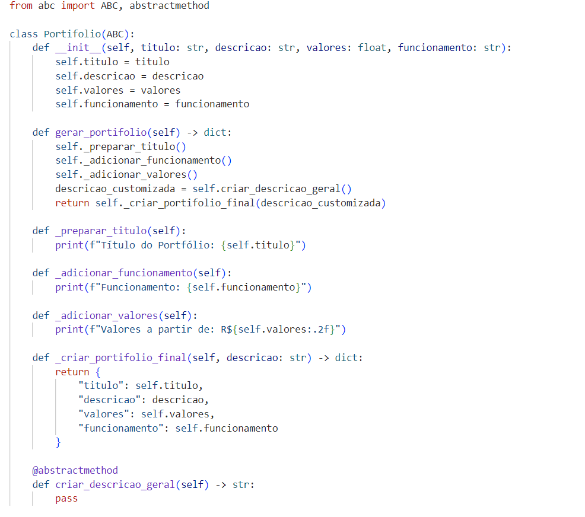

# Template Method

## Participações

| Nome                                 |
|--------------------------------------|
| [Breno Soares Fernandes](https://github.com/brenofrds)|
| [Bruno de Oliveira](https://github.com/BrunoOLiveirax) |
| [Bruno Ricardo de Menezes](https://github.com/EhOBruno) |
| [Mayara Alves de Oliveira](https://github.com/Mayara-tech) |
| [Vinicius Castelo](https://github.com/Vini47) |

## Introdução

O Template Method é um padrão de projeto comportamental que define o esqueleto de um algoritmo em um método da classe base, permitindo que subclasses substituam etapas específicas do processo sem alterar sua estrutura geral. Esse padrão é amplamente utilizado quando há um fluxo fixo de execução, mas algumas etapas desse fluxo podem variar dependendo do contexto.

Ao aplicar o Template Method, promove-se a reutilização de código, mantendo a lógica comum centralizada na superclasse abstrata, enquanto as particularidades são tratadas nas subclasses. Isso melhora a manutenibilidade, favorece a extensibilidade e segue o princípio do "aberto para extensão, fechado para modificação" (princípio OCP, do SOLID).

No contexto de sistemas orientados a objetos, o Template Method é especialmente útil para modelar comportamentos que seguem uma sequência lógica, mas que devem ser adaptáveis a diferentes especializações como no caso de diferentes tipos de portfólios, onde todos seguem um mesmo processo de geração, mas com conteúdos distintos.

## Objetivo

O objetivo é aplicar o padrão de projeto Template Method na modelagem da classe Portfólio, visando estruturar um fluxo comum para a geração de descrições personalizadas, mas mantendo a flexibilidade necessária para contemplar diferentes tipos de serviços oferecidos por fornecedores, como buffet, fotografia e confeitaria.

Com isso, busca-se padronizar o processo de criação de portfólios, centralizando a lógica compartilhada em uma classe abstrata e delegando às subclasses a responsabilidade de implementar as variações específicas. Essa abordagem proporciona maior organização do código, reutilização de lógica, facilidade de manutenção e aderência aos princípios da programação orientada a objetos.

## Metodologia

A metodologia adotada seguiu uma abordagem com foco na melhoria da estrutura de código orientado a objetos por meio do uso do padrão de projeto Template Method. O processo teve como base a análise do [diagrama de classes do sistema](https://unbarqdsw2025-1-turma01.github.io/2025.1-T01-_G4_QuemFazNiver_GostaDe_Entrega_03/#/PadroesDeProjeto/3.5.1.Diagramadeclasses), que representava o relacionamento entre entidades como Fornecedor, Portfólio e suas especializações.

Inicialmente, foi realizada uma avaliação do modelo de classes existente, identificando pontos de repetição e acoplamento excessivo nas implementações de diferentes tipos de portfólios. A partir dessa análise, percebeu-se a necessidade de padronizar o processo de criação e exibição de dados nos portfólios de forma flexível, porém unificada.

Com base nessa necessidade, o padrão Template Method foi implementado por meio da criação de uma classe abstrata Portifolio, responsável por definir o fluxo principal de geração do portifolio (templatePortifolio()), deixando para as subclasses (PortifolioBuffet, PortifolioFotografia, PortifolioConfeitaria) a responsabilidade de implementar os métodos específicos no CriarDescricaoGeral().

O novo modelo foi elaborado visualmente na figura 1 utilizando a ferramenta Lucidchart, o que permitiu simular a hierarquia de herança e visualizar claramente a estrutura do padrão aplicado. Após a validação do modelo visual, o comportamento foi traduzido para o código-fonte, aplicando os princípios da programação orientada a objetos.

Essa metodologia permitiu não apenas melhorar a organização e legibilidade do código, mas também garantir maior reutilização e escalabilidade para futuras adições de novos tipos de portfólios, mantendo a lógica central consistente.

## Diagrama de classe

<b>Figura 1: Template Method</b>

Autores: <a href="https://github.com/Mayara-tech">Mayara Alves de Oliveira</a>, <a href="https://github.com/brenofrds">Breno Soares Fernandes</a>, 
<a href="https://github.com/BrunoOLiveirax">Bruno de Oliveira</a>, 
<a href="https://github.com/EhOBruno">Bruno Ricardo de Menezes</a>, 
<a href="https://github.com/Vini47">Vinicius Castelo</a>

## Análise do Diagrama

O diagrama elaborado com base no padrão de projeto Template Method aplicado à classe Portifolio demonstra uma estrutura sólida e coerente com os princípios da programação orientada a objetos. A classe abstrata Portifolio centraliza o fluxo principal por meio do método templatePortifolio(), que define a sequência de etapas a serem seguidas na geração dos portfólios. Esse método atua como o esqueleto do algoritmo, enquanto a responsabilidade de implementar a etapa específica — no caso, CriarDescricaoGeral() — é delegada às subclasses concretas.

As subclasses PortifolioBuffet, PortifolioFotografia e PortifolioConfeitaria representam variações específicas de serviços, cada uma contendo atributos próprios e implementações distintas do método abstrato, o que garante personalização sem comprometer a estrutura geral. Essa separação respeita o princípio da responsabilidade única, uma vez que cada classe possui uma função clara e bem definida, além de permitir a manutenção e evolução independentes.

Outro ponto de destaque é a aderência ao princípio aberto/fechado (Open/Closed Principle), pois o modelo está preparado para futuras extensões como a inclusão de novos tipos de portfólios sem a necessidade de alterar o código da superclasse. Além disso, a centralização de atributos e métodos comuns na classe abstrata reduz a duplicação de código e aumenta a coesão interna, promovendo uma arquitetura mais limpa e reutilizável.

O uso do Template Method nesse contexto contribui diretamente para a padronização do processo de geração de descrições, ao mesmo tempo em que oferece flexibilidade para adaptação a diferentes contextos. O diagrama desenvolvido no Lucidchart permitiu visualizar com clareza essa estrutura hierárquica e lógica, servindo como base para a melhoria do código e a reorganização das classes do sistema.

## Código do UML Diagrama de Classes

`Template portifolio`

`Portfólio Buffet`

`Portfólio Fotografia`

`Portfólio Confeitaria`

## Saída

`Saidas Portfólio`

## Conclusão

A utilização do padrão Template Method no contexto do sistema permitiu padronizar o processo de geração de portfólios para diferentes tipos de fornecedores, como buffet, fotografia e confeitaria. A estrutura criada, com uma superclasse abstrata Portifolio e subclasses específicas (PortifolioBuffet, PortifolioFotografia, PortifolioConfeitaria), possibilitou definir um fluxo fixo por meio do método templatePortifolio(), enquanto manteve a flexibilidade para que cada subclasse implementasse a lógica própria da descrição geral.

Esse padrão foi fundamental para organizar o código de forma mais clara e reutilizável, evitando duplicações e facilitando a manutenção. Além disso, a solução está alinhada aos princípios da programação orientada a objetos, uma vez que novos tipos de portfólio podem ser adicionados sem impactar os existentes.

A aplicação do Template Method neste contexto demonstrou ser eficiente e elegante, permitindo que o sistema evolua com consistência e robustez. Ao separar o que é comum do que é variável, a modelagem se tornou mais modular, facilitando a adaptação a novas demandas e garantindo maior escalabilidade para o projeto como um todo.

## Bibliografica

[1] **SERRANO, M.**. *Material em Slides*. Disponível em: <https://aprender3.unb.br/pluginfile.php/3075185/mod_page/content/1/Arquitetura%20e%20Desenho%20de%20Software%20-%20Aula%20GoFs%20Criacionais%20-%20Profa.%20Milene.pdf.>  Acesso em: 28 Mai. 2025.

[2] **SERRANO, M.** *Video-Aula - DSW - GoFs - Comportamentais - template method*. Disponível em: <https://unbbr-my.sharepoint.com/personal/mileneserrano_unb_br/_layouts/15/stream.aspx id=%2Fpersonal%2Fmileneserrano%5Funb%5Fbr%2FDocuments%2FArqDSW%20%2D%20V%C3%ADdeosOriginais%2F10c%20%2D%20Video%2DAula%20%2D%20DSW%20%2D%20GoFs%20%2D%20Comportamentais%20%2D%20Template%20Method%2Emp4&ga=1&referrer=StreamWebApp%2EWeb&referrerScenario=AddressBarCopied%2Eview%2E7c23db09%2D430d%2D4c7b%2Db5ec%2D25ea794316c7>. Acesso em: 28 Mai. 2025.

## Histórico de versões

| Versão |    Data    |                       Descrição                       |                       Autor(es)                        |                      Revisor(es)                       |
| :----: | :--------: | :---------------------------------------------------: | :----------------------------------------------------: | :----------------------------------------------------: |
| `1.0`  | 31/05/2025 | Criação do diagrama   | [Mayara Alves](https://github.com/Mayara-tech), [Breno Soares Fernandes](https://github.com/brenofrds) e [Bruno de Oliveira](https://github.com/BrunoOLiveirax) | [Bruno Ricardo de Menezes](https://github.com/EhOBruno) e [Vinicius Castelo](https://github.com/Vini47) |
| `1.1`  | 01/06/2025 | Criação da pagina do template method| [Mayara Alves](https://github.com/Mayara-tech) | [Breno Soares Fernandes](https://github.com/brenofrds) |
| `1.2`  | 01/06/2025 | adição da introdução e conclusão template method| [Mayara Alves](https://github.com/Mayara-tech), [Bruno Ricardo de Menezes](https://github.com/EhOBruno) e [Vinicius Castelo](https://github.com/Vini47)  | [Breno Soares Fernandes](https://github.com/brenofrds) e [Bruno de Oliveira](https://github.com/BrunoOLiveirax) |
| `1.3`  | 01/06/2025 | adição da metodologia e analise template method| [Mayara Alves](https://github.com/Mayara-tech), [Breno Soares Fernandes](https://github.com/brenofrds) e [Bruno de Oliveira](https://github.com/BrunoOLiveirax) |[Vinicius Castelo](https://github.com/Vini47) |
| `1.4`  | 01/06/2025 | Criação do código | [Mayara Alves](https://github.com/Mayara-tech), [Bruno Ricardo de Menezes](https://github.com/EhOBruno) e [Vinicius Castelo](https://github.com/Vini47) |  [Breno Soares Fernandes](https://github.com/brenofrds)  |
