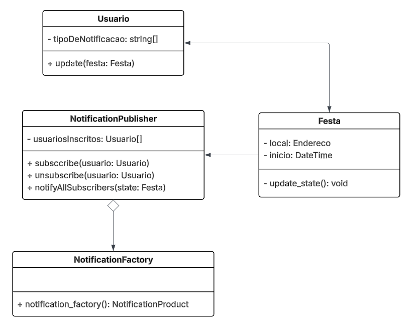

# Observer

## Participações

| Nome                                 |
|--------------------------------------|
| [Breno Queiroz Lima](https://github.com/brenob6)|
| [Leandro de Almeida Oliveira](https://github.com/leomitx10)   |
| [Letícia Resende da Silva](https://github.com/LeticiaResende23) |
| [Hauedy Wegener Soares](https://github.com/HauedyWS) |
| [Matheus Barros do Nascimento](https://github.com/Ninja-Haiyai) |

## Introdução

 &emsp;&emsp;Dentro dos padrões de projeto GoF (Gang of Four), descritos por Erich Gamma, Richard Helm, Ralph Johnson e John Vlissides no livro “Design Patterns: Elements of Reusable Object-Oriented Software”, publicado em 1994, existe a categoria dos padrões comportamentais, que têm como objetivo definir maneiras eficazes de comunicação e interação entre objetos.

 &emsp;&emsp;O padrão de projeto comportamental Observer estabelece uma dependência entre objetos, de forma que quando um objeto muda de estado, todos os seus dependentes são automaticamente notificados e atualizados.

## Objetivo

 &emsp;&emsp;O padrão Observer tem como objetivo permitir que um objeto principal avise outros objetos automaticamente sempre que alguma coisa mudar nele. Isso é útil quando várias partes do sistema precisam saber sobre uma mudança, como por exemplo em uma interface gráfica, onde diferentes componentes precisam se atualizar quando algo acontece.

## Metodologia

&emsp;&emsp;Para desenvolver este trabalho, começamos com uma pesquisa teórica sobre o padrão de projeto Observer. Utilizamos como base o site Refactoring Guru e também os materiais fornecidos pela professora, como slides e videoaulas.
 

&emsp;&emsp;Depois da pesquisa, o grupo se reuniu para compartilhar o que cada integrante aprendeu. Essa troca de conhecimentos nos ajudou a tirar dúvidas e entender melhor a aplicação prática do padrão. Juntos, criamos um diagrama que representa o funcionamento do padrão Observer dentro do contexto do nosso projeto.
 

&emsp;&emsp;Com o diagrama definido, seguimos para a implementação no código do nosso projeto. Utilizamos o padrão Observer para lidar com situações onde era necessário que múltiplos objetos fossem notificados automaticamente sempre que houvesse alguma mudança em um objeto principal, garantindo uma comunicação mais organizada e eficiente entre os componentes.

# Diagrama

**Image 1: Observer method**

Autor(a): 
<a href="https://github.com/brenob6" target="_blank">Breno Queiroz Lima</a>, 
<a href="https://github.com/leomitx10" target="_blank">Leandro de Almeida Oliveira</a>, 
<a href="https://github.com/LeticiaResende23" target="_blank">Letícia Resende da Silva</a>, 
<a href="https://github.com/Vini47" target="_blank">Vinicius Castelo</a>,
<a href="https://github.com/hauedyWS" target="_blank">Hauedy</a> e
<a href="https://github.com/Ninja-Haiyai" target="_blank">Matheus Barros do Nascimento</a>

## Análise do Diagrama

&emsp;&emsp;O diagrama representa a organização da nossa aplicação destinada ao planejamento de festas de aniversário, permitindo ao usuário planejar eventos, administrar convidados e transmitir atualizações de maneira eficaz. A classe principal é "Festa", que guarda dados vitais como a relação de convidados, a data da celebração e os temas do evento. Ela possibilita a inclusão de novos participantes, a definição de desejos de presentes e o envio de convites aos inscritos. Para facilitar a comunicação, a festa implementa um sistema de notificações baseado no padrão Observer, representado pela classe "NotificationPublisher". Esta classe mantém um registro dos usuários inscritos e permite a notificação automática sempre que ocorrerem alterações significativas no evento, como a inclusão de novos anseios ou mudanças na data.

&emsp;&emsp;A "NotificationFactory" é a responsável por completar esse mecanismo, criando instâncias de notificações. A conexão entre essas categorias assegura que o aplicativo possa proporcionar uma experiência suave ao anfitrião da festa, que consegue manter os convidados atualizados de maneira automatizada e personalizada, intensificando o envolvimento e a estruturação do evento.

## Código do UML Diagrama de Classes

## Saída

## Conclusão

## Bibliografica

[1] **SERRANO, M.**. *Material em Slides*. Disponível em: <https://aprender3.unb.br/pluginfile.php/3075187/mod_page/content/1/Arquitetura%20e%20Desenho%20de%20Software%20-%20Aula%20GoFs%20Estruturais%20-%20Profa.%20Milene.pdf>  Acesso em: 28 Mai. 2025.

[2] **SERRANO, M.** *Vídeo-Aula - DSW - GoFs - Comportamentais*. Disponível em: <https://unbbr-my.sharepoint.com/:v:/g/personal/mileneserrano_unb_br/Ed5jtliOrNVOlKoPe-6Llp0BNLgJ9Q6NHPIKnzmshzHmvA?e=517a4O>. Acesso em: 28 Mai. 2025.

## Histórico de versões

| Versão |    Data    |                       Descrição                       |                       Autor(es)                        |                      Revisor(es)                       |
| :----: | :--------: | :---------------------------------------------------: | :----------------------------------------------------: | :----------------------------------------------------: |
| `1.0`  | 29/05/2025 | Adiciona introdução, objetivo, metodologia e bibliografia | [Leandro de Almeida Oliveira](https://github.com/leomitx10) | [Matheus Barros do Nascimento](https://github.com/Ninja-Haiyai) |
| `1.1`  | 01/06/2025 | Adicionar diagrama | [Breno Queiroz Lima](https://github.com/brenob6) | [Leandro de Almeida Oliveira](https://github.com/leimit10) |
| `1.2`  | 01/06/2025 | Adicionado análise do diagrama | [Matheus Barros do Nascimento](https://github.com/Ninja-Haiyai) | [Leandro de Almeida Oliveira](https://github.com/leimit10) |
