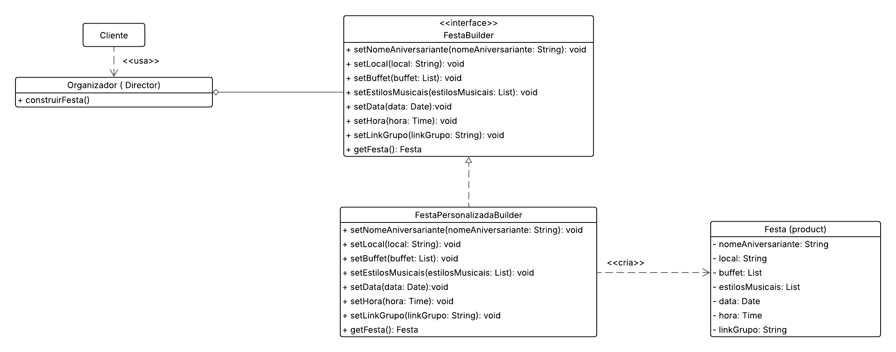

# Builder - Organização de Festas

## Participações

| Nome                                 |
|--------------------------------------|
| [Breno Soares Fernandes](https://github.com/brenofrds) |
| [Bruno Ricardo de Menezes](https://github.com/EhOBruno) |

## Introdução

<p align="justify">&emsp;&emsp;O padrão de projeto <strong>Builder</strong>, pertencente à categoria dos padrões criacionais do GoF (Gang of Four), tem como objetivo central <strong>separar a construção de um objeto complexo da sua representação final</strong>. Ele é ideal para cenários em que um objeto precisa ser montado em etapas, ou pode ser construído de maneiras diferentes.</p>

<p align="justify">&emsp;&emsp;Neste trabalho, o padrão Builder foi aplicado na criação de uma <strong>festa personalizada</strong> para um aniversariante, baseada nas preferências informadas em um quiz. A construção da festa envolve a definição do local, do buffet, dos estilos musicais, da data, hora e do link do grupo. Ao final, é gerado automaticamente um convite consolidando todas as escolhas.</p>

## Objetivo

<p align="justify">&emsp;&emsp;Nosso objetivo com o uso do Builder foi <strong>modularizar e organizar a criação da festa</strong> de forma limpa e reutilizável. Ao invés de construir manualmente o objeto `Festa` dentro do código do sistema, centralizamos essa responsabilidade dentro de um builder especializado.</p>

<p align="justify">&emsp;&emsp;Com isso, o código principal (cliente) apenas fornece os dados e aciona o construtor, garantindo que a lógica de montagem permaneça encapsulada. Isso facilita manutenção, testes e futuras extensões do sistema (como incluir fotógrafo, decoração, etc.).</p>

## Metodologia

<p align="justify">&emsp;&emsp;A implementação foi feita com base no conteúdo apresentado em aula, incluindo os slides e exemplos fornecidos pela professora. O grupo analisou o diagrama padrão do Builder e, a partir dele, adaptou a arquitetura para o contexto da organização de festas, priorizando clareza, separação de responsabilidades e reuso.</p>

<p align="justify">&emsp;&emsp;O diagrama UML foi utilizado como guia para a implementação das classes `Festa` (produto), `FestaBuilder` (interface abstrata), `FestaPersonalizadaBuilder` (concreto) e `Organizador` (diretor). A montagem da festa foi testada com dados reais capturados do terminal, e exibida ao final com a geração do convite.</p>

## Diagrama Builder

<center>

<b>Imagem 1: Diagrama Builder (Organização de Festa)</b>  
<br>



Autores: <a href="https://github.com/brenofrds">Breno Soares Fernandes</a>, <a href="https://github.com/EhOBruno">Bruno Ricardo de Menezes</a> 

</center>

## Análise do Diagrama

<p align="justify">&emsp;&emsp;No diagrama, temos o `Organizador` como <b>Diretor</b> responsável por orquestrar a montagem da festa. Ele delega cada etapa ao `FestaBuilder`, que define os métodos abstratos para configurar local, buffet, estilos musicais, data, hora e link do grupo.</p>

<p align="justify">&emsp;&emsp;A classe concreta `FestaPersonalizadaBuilder` implementa essas etapas e monta o objeto final `Festa`. O produto `Festa` armazena todos os atributos que compõem a comemoração. Com isso, a responsabilidade de construção é isolada e o processo de criação torna-se flexível e reutilizável.</p>

<p align="justify">&emsp;&emsp;Compreendemos que, em geral, o padrão Builder é utilizado com diferentes tipos de builders concretos. No entanto, para adaptar ao nosso contexto, optamos por implementar apenas o `FestaPersonalizadaBuilder`, o qual já resolve nosso cenário.</p>

## Código

```python
from abc import ABC, abstractmethod
from typing import List
from datetime import date, time

# Produto
class Festa:
    def __init__(self):
        self.nomeAniversariante = ""
        self.local = ""
        self.buffet = []
        self.estilosMusicais = []
        self.data = None
        self.hora = None
        self.linkGrupo = ""

# Interface Builder
class FestaBuilder(ABC):
    @abstractmethod
    def setNomeAniversariante(self, nomeAniversariante: str): pass
    @abstractmethod
    def setLocal(self, local: str): pass
    @abstractmethod
    def setBuffet(self, buffet: List[str]): pass
    @abstractmethod
    def setEstilosMusicais(self, estilosMusicais: List[str]): pass
    @abstractmethod
    def setData(self, data: date): pass
    @abstractmethod
    def setHora(self, hora: time): pass
    @abstractmethod
    def setLinkGrupo(self, linkGrupo: str): pass
    @abstractmethod
    def getFesta(self) -> Festa: pass

# Implementação concreta
class FestaPersonalizadaBuilder(FestaBuilder):
    def __init__(self):
        self.festa = Festa()

    def setNomeAniversariante(self, nomeAniversariante: str):
        self.festa.nomeAniversariante = nomeAniversariante

    def setLocal(self, local: str):
        self.festa.local = local

    def setBuffet(self, buffet: List[str]):
        self.festa.buffet = buffet

    def setEstilosMusicais(self, estilosMusicais: List[str]):
        self.festa.estilosMusicais = estilosMusicais

    def setData(self, data: date):
        self.festa.data = data

    def setHora(self, hora: time):
        self.festa.hora = hora

    def setLinkGrupo(self, linkGrupo: str):
        self.festa.linkGrupo = linkGrupo

    def getFesta(self) -> Festa:
        return self.festa

# Diretor
class Organizador:
    def __init__(self, builder: FestaBuilder):
        self.builder = builder

    def construirFesta(self, nomeAniversariante: str, local: str, buffet: List[str],
                       estilosMusicais: List[str], data: date, hora: time, linkGrupo: str) -> Festa:
        self.builder.setNomeAniversariante(nomeAniversariante)
        self.builder.setLocal(local)
        self.builder.setBuffet(buffet)
        self.builder.setEstilosMusicais(estilosMusicais)
        self.builder.setData(data)
        self.builder.setHora(hora)
        self.builder.setLinkGrupo(linkGrupo)
        return self.builder.getFesta()
```
## Saída

<p align="justify">&emsp;&emsp;Considerando que o convite é gerado automaticamente após a criação da festa, a saída do Builder e do Bridge são equivalentes.</p>

**Imagem de exemplo do convite gerado e a lista de preferências:**


---

## Conclusão

A implementação do padrão **Builder** permitiu experimentar uma **separação clara entre o processo de construção de um objeto complexo (a festa) e sua representação final**. Isso favoreceu o **reuso de código**, a **clareza nas responsabilidades** e a **flexibilidade para adaptar ou estender o sistema**.

Além disso, o padrão se encaixou naturalmente na proposta do projeto, onde várias partes da festa são personalizadas conforme as escolhas do usuário. O uso do Builder tornou essas personalizações **fáceis de aplicar e isoladas da lógica principal**.

Trabalhar em equipe foi essencial para transformar o aprendizado teórico em prática, estruturando um código **funcional e alinhado com boas práticas de arquitetura de software**.

---

## Bibliografia

[1] **SERRANO, M.** Material Complementar - Aula GoFs Criacionais. Disponível em: Aprender3 da turma. Acesso em: 01 Jun. 2025.  
[2] **SERRANO, M.** 08d - Video-Aula - DSW - GoFs - Criacionais - Demais. Disponível em: Aprender3 da turma. Acesso em: 01 Jun. 2025.

---

## Histórico de versões

| Versão | Data       | Descrição                                                                 | Autor(es)                                                                                   |
|--------|------------|---------------------------------------------------------------------------|---------------------------------------------------------------------------------------------|
| 1.0    | 02/06/2025 | Implementação extra do padrão Builder com base na iniciativa de refatoração do projeto. | [Breno Soares Fernandes](https://github.com/brenofrds), [Bruno Ricardo de Menezes](https://github.com/EhOBruno) |

