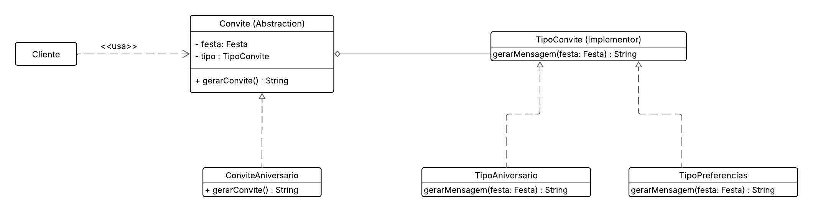
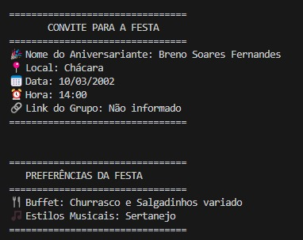

# Bridge - Convite e Preferências

## Participações

| Nome                                 |
|--------------------------------------|
| [Breno Soares Fernandes](https://github.com/brenofrds) |
| [Bruno Ricardo de Menezes](https://github.com/EhOBruno) |

---

## Introdução

O padrão de projeto **Bridge**, pertencente à categoria dos padrões **estruturais** do GoF (Gang of Four), tem como objetivo **desacoplar uma abstração de sua implementação**, permitindo que ambas evoluam de forma independente.

Neste projeto, o Bridge foi aplicado para **gerar diferentes formas de exibição das informações de uma festa**, como o convite e a lista de preferências, separando a lógica de estruturação da mensagem da lógica de construção da festa.

---

## Objetivo

Nosso objetivo foi substituir a classe `FestaUtils` por uma arquitetura mais flexível, que permita gerar novos formatos de apresentação da festa com o mínimo de esforço e acoplamento. Com o uso do Bridge, conseguimos reutilizar a lógica de criação de mensagens com implementações diferentes (ex: convite, lista de preferências, mensagens para redes sociais, etc.).

---

## Metodologia

<p align="justify">&emsp;&emsp;A implementação foi realizada com base no conteúdo apresentado em aula, incluindo os slides e exemplos fornecidos pela professora. O grupo analisou o diagrama padrão do Bridge e, a partir dele, adaptou a arquitetura para o contexto da geração de convites e preferências, priorizando a separação entre abstração e implementação, flexibilidade e reuso.</p>

<p align="justify">&emsp;&emsp;O diagrama UML foi utilizado como guia para a implementação das classes `TipoConvite` (interface para geração de mensagens), `TipoConviteFesta` e `TipoListaPreferencias` (implementações concretas), além das abstrações `Convite`, `ConviteFesta` e `ListaPreferencias`. A estrutura foi testada para garantir que diferentes formatos de apresentação pudessem ser gerados sem alterar a lógica principal.</p>

---

## Diagrama Bridge

<center>

<b>Imagem 1: Diagrama Bridge (Convite e Preferências)</b>  
<br>



Autores: <a href="https://github.com/brenofrds">Breno Soares Fernandes</a>, <a href="https://github.com/EhOBruno">Bruno Ricardo de Menezes</a> 

</center>

---

## Análise do Diagrama

A estrutura do padrão foi dividida da seguinte forma:

- **`TipoConvite`** (Implementor): Interface para geração de mensagens.
- **`TipoConviteFesta`** e **`TipoListaPreferencias`** (Concrete Implementors): Implementações específicas de convite e preferências.
- **`Convite`** (Abstraction): Define a interface de alto nível.
- **`ConviteFesta`** e **`ListaPreferencias`** (Refined Abstractions): Definem tipos distintos de mensagem, utilizando um `TipoConvite`.

Essa separação permite que cada tipo de mensagem possa ser combinado com qualquer lógica de formatação, facilitando extensões futuras.

---

## Código

### Implementor e Concretos

```python
from abc import ABC, abstractmethod
from .builder import Festa

# Implementor
class TipoConvite(ABC):
    @abstractmethod
    def gerarMensagem(self, festa: Festa) -> str:
        pass

# Concrete Implementor 1 - Convite
class TipoConviteFesta(TipoConvite):
    def gerarMensagem(self, festa: Festa) -> str:
        return f"""
        ================================
               CONVITE PARA A FESTA
        ================================
        🎉 Nome do Aniversariante: {festa.nomeAniversariante}
        📍 Local: {festa.local}
        📅 Data: {festa.data.strftime('%d/%m/%Y')}
        ⏰ Hora: {festa.hora.strftime('%H:%M')}
        🔗 Link do Grupo: {festa.linkGrupo if festa.linkGrupo else 'Não informado'}
        ================================
        """

# Concrete Implementor 2 - Preferências
class TipoListaPreferencias(TipoConvite):
    def gerarMensagem(self, festa: Festa) -> str:
        return f"""
        ================================
           PREFERÊNCIAS DA FESTA
        ================================
        🍴 Buffet: {', '.join(festa.buffet)}
        🎵 Estilos Musicais: {', '.join(festa.estilosMusicais)}
        ================================
        """
```

### Abstraction e Refinamentos

```python
# Abstraction
class Convite(ABC):
    def __init__(self, festa: Festa, tipo: TipoConvite):
        self.festa = festa
        self.tipo = tipo

    @abstractmethod
    def gerarConvite(self) -> str:
        pass

# Refined Abstraction - Convite da Festa
class ConviteFesta(Convite):
    def gerarConvite(self) -> str:
        return self.tipo.gerarMensagem(self.festa)

# Refined Abstraction - Lista de Preferências
class ListaPreferencias(Convite):
    def gerarConvite(self) -> str:
        return self.tipo.gerarMensagem(self.festa)
```

## Saída

<p align="justify">&emsp;&emsp;Considerando que o convite é gerado automaticamente após a criação da festa, a saída do Builder e do Bridge são equivalentes.</p>

**Imagem de exemplo do convite gerado e a lista de preferências:**



## Conclusão

A implementação do padrão **Bridge** facilitou a **separação entre abstração e implementação**, promovendo uma estrutura mais **limpa e flexível para extensão**. Isso nos permitiu apresentar a mesma festa de maneiras diferentes, **sem duplicar lógica ou acoplar comportamentos**.

Essa estratégia será especialmente útil caso o sistema seja estendido para **novos formatos de convite** (como PDF, e-mail, mensagem em rede social), **sem necessidade de alterar a lógica principal**.

---

## Bibliografia

[1] **SERRANO, M.** Material Complementar - Aula GoFs Estruturais. Disponível em: Aprender3 da turma. Acesso em: 01 Jun. 2025.  
[2] **SERRANO, M.** 08d - Video-Aula - DSW - GoFs - Estruturais - Demais. Disponível em: Aprender3 da turma. Acesso em: 01 Jun. 2025.

---

## Histórico de versões

| Versão | Data       | Descrição                                                           | Autor(es)                                                                                   |
|--------|------------|---------------------------------------------------------------------|---------------------------------------------------------------------------------------------|
| 1.0    | 02/06/2025 | Implementação do padrão Bridge para geração de convites e preferências. | [Breno Soares Fernandes](https://github.com/brenofrds), [Bruno Ricardo de Menezes](https://github.com/EhOBruno) |
