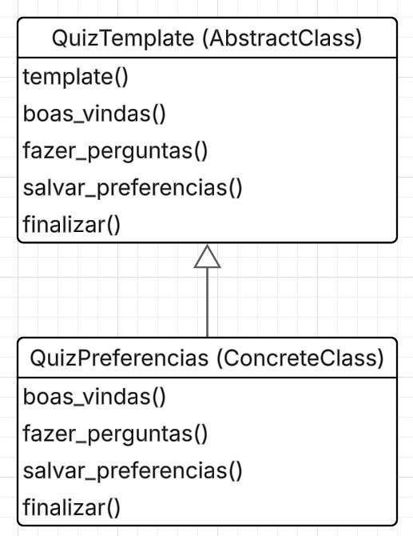
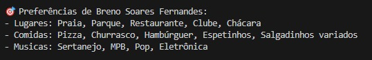

# Template Method - Quiz de Preferências

## Participações

| Nome                                 |
|--------------------------------------|
| [Breno Soares Fernandes](https://github.com/brenofrds) |
| [Bruno Ricardo de Menezes](https://github.com/EhOBruno) |

---

## Introdução

O padrão de projeto **Template Method**, pertencente à categoria comportamental dos GoF, define o esqueleto de um algoritmo em uma superclasse, permitindo que subclasses personalizem partes do processo sem alterar sua estrutura geral.

Neste projeto, aplicamos o padrão para estruturar o fluxo do **quiz de preferências do aniversariante**, mantendo a sequência de execução fixa, mas permitindo personalizar como as perguntas são feitas e como as preferências são salvas.

---

## Objetivo

Nosso objetivo foi utilizar o Template Method para padronizar o processo de coleta e salvamento das preferências dos usuários, garantindo consistência no fluxo e flexibilidade para adaptar o comportamento de acordo com o ambiente (terminal, web, etc.).

A superclasse `QuizTemplate` define o esqueleto da execução do quiz. Já a subclasse `QuizPreferenciasTerminal` implementa a lógica concreta para ambientes de terminal, sendo possível no futuro criar subclasses para outros contextos (ex: interface gráfica ou chatbot).

---

## Metodologia

<p align="justify">&emsp;&emsp;A implementação foi realizada com base no conteúdo apresentado em aula, incluindo os slides e exemplos fornecidos pela professora. O grupo analisou o diagrama padrão do Template Method e, a partir dele, adaptou a arquitetura para o contexto do quiz de preferências, priorizando clareza, separação de responsabilidades e reuso.</p>

<p align="justify">&emsp;&emsp;O diagrama UML foi utilizado como guia para a implementação das classes `QuizTemplate` (superclasse abstrata) e `QuizPreferenciasTerminal` (subclasse concreta). A execução do quiz foi testada em ambiente de terminal, garantindo que o fluxo de perguntas e salvamento das preferências fosse consistente e funcional.</p>

---

## Diagrama Template Method

<center>

<b>Imagem 1: Diagrama Template Method (Quiz de Preferências)</b>  
<br>



Autores: <a href="https://github.com/brenofrds">Breno Soares Fernandes</a>, <a href="https://github.com/EhOBruno">Bruno Ricardo de Menezes</a> 

</center>
---

## Análise do Diagrama

A implementação foi realizada em Python, estruturando o quiz em duas classes principais:

- `QuizTemplate` (abstrata): define o método `executar_quiz()`, que encapsula o fluxo comum:
  1. `boas_vindas()`
  2. `fazer_perguntas()`
  3. `salvar_preferencias()`
  4. `finalizar()`

- `QuizPreferenciasTerminal`: especialização concreta que:
  - Exibe perguntas no terminal com listas de opções.
  - Permite múltiplas seleções por categoria (lugares, comidas, músicas).
  - Salva os dados no dicionário do usuário.

Com isso, o código ficou modular e fácil de extender.

---

## Código

### Superclasse Abstrata

```python
from abc import ABC, abstractmethod

class QuizTemplate(ABC):
    def executar_quiz(self, usuario):
        self.boas_vindas()
        respostas = self.fazer_perguntas()
        self.salvar_preferencias(usuario, respostas)
        self.finalizar()

    def boas_vindas(self):
        print("\n🎉 Bem-vindo ao quiz de preferências para sua festa!")

    @abstractmethod
    def fazer_perguntas(self):
        pass

    @abstractmethod
    def salvar_preferencias(self, usuario, respostas):
        pass

    def finalizar(self):
        print("✅ Preferências salvas com sucesso!\n")
```

### Subclasse: Terminal

```
from .base_quiz import QuizTemplate

class QuizPreferenciasTerminal(QuizTemplate):
    def fazer_perguntas(self):
        perguntas = {
            "lugares": [
                "Praia", "Campo", "Parque", "Cinema", "Boate", "Restaurante", "Casa de amigos",
                "Clube", "Cobertura com vista", "Chácara", "Balada temática", "Piquenique no parque"
            ],
            "comidas": [
                "Pizza", "Churrasco", "Sushi", "Hambúrguer", "Tábua de frios", "Docinhos de festa",
                "Espetinhos", "Massas (lasanha, macarronada)", "Comida mexicana", "Cachorro-quente",
                "Salgadinhos variados", "Sorvete e milk-shake"
            ],
            "musicas": [
                "Sertanejo", "Rock", "Funk", "MPB", "Pop", "Eletrônica", "Axé", "Pagode",
                "Brega funk", "Trap", "Forró", "K-pop", "Anos 2000", "Reggaeton"
            ]
        }

        respostas = {}

        for categoria, opcoes in perguntas.items():
            print(f"\n{categoria.capitalize()} que você gostaria no seu aniversário:")
            for i, opcao in enumerate(opcoes, 1):
                print(f"{i}. {opcao}")
            entrada = input("Escolha os números separados por vírgula: ")
            selecionados = [opcoes[int(i.strip()) - 1] for i in entrada.split(",") if i.strip().isdigit()]
            respostas[categoria] = selecionados

        return respostas

    def salvar_preferencias(self, usuario, respostas):
        usuario["preferencias"] = respostas
```

## Saída

**Imagem de exemplo do convite gerado e a lista de preferências:**



## Bibliografia

[1] **SERRANO, M.** Material Complementar - Aula GoFs Comportamentais. Disponível em: Aprender3 da turma. Acesso em: 01 Jun. 2025.  
[2] **SERRANO, M.** 08d - Video-Aula - DSW - GoFs - Comportamentais - Demais. Disponível em: Aprender3 da turma. Acesso em: 01 Jun. 2025.

---

## Histórico de versões

| Versão | Data       | Descrição                                                           | Autor(es)                                                                                   |
|--------|------------|---------------------------------------------------------------------|---------------------------------------------------------------------------------------------|
| 1.0    | 02/06/2025 | Implementação do padrão Template Method para a resposta do quiz. | [Breno Soares Fernandes](https://github.com/brenofrds), [Bruno Ricardo de Menezes](https://github.com/EhOBruno) |